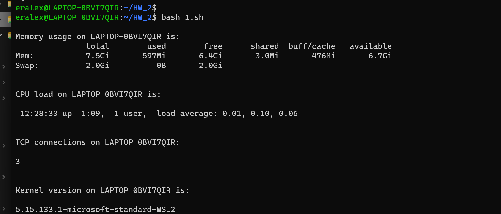
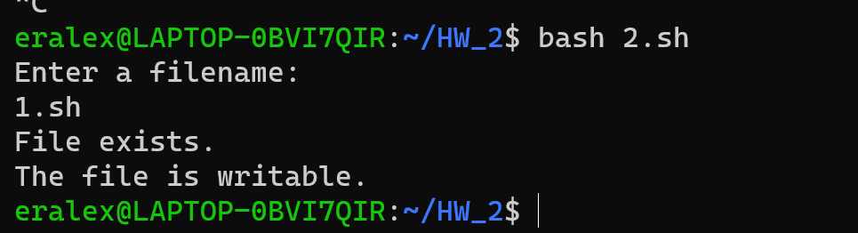
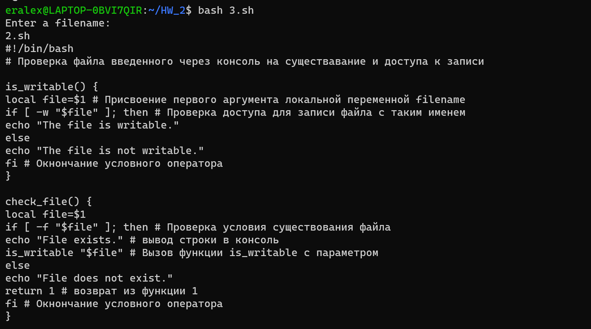
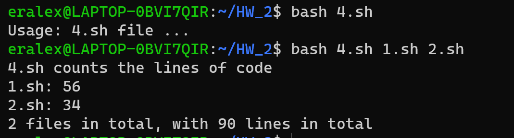
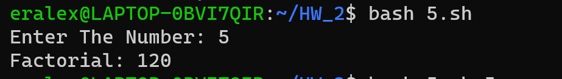

# Отчет

В данных примерах были использованы конструкции `if-else` и `while-do-done`, а так же функции на bash, вызываемые из других функций (`1.sh`).


1. Для теста первого файла `1.sh` пропишите в консоль (при условии что файл лежит в текущей папке, в которой вы находитесь):
```
bash 1.sh
  ``` 

  

2. Для теста  файла `2.sh` пропишите в консоль (при условии что файл лежит в текущей папке, в которой вы находитесь):
```
bash 2.sh
```
Далее, после запуска будет предложено ввести имя файла.



3. Для теста  файла `3.sh` анологично пункту 2, но в  консоль:
``` 
bash 3.sh
```
Желательно вводить непустой файл так как программа выводит содержимое файла.


4. Для теста  файла `4.sh` в  консоль пропишите:
```
bash 4.sh <args>
```
Вместо `<args>` вставьте различные текстовые файлы. Например:  ``` bash 4.sh 2.sh 1.sh```

Программа посчитает суммарное количество строк во всех введенных файлах (2.sh 1.sh).



5.  Для теста  файла `5.sh` в  консоль пропишите:
```
bash 5.sh <number>
```
Вместо `<number>` введите любое число.  Например:  ``` bash 5.sh 3```.
Программа выведет факториал числа 3


