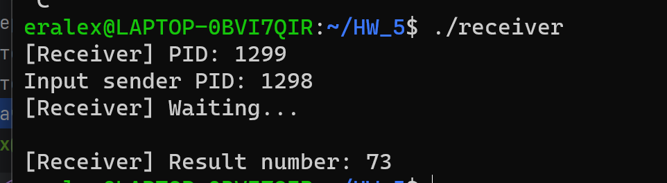
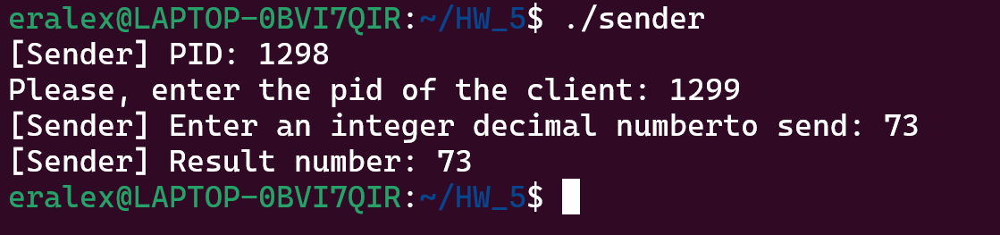
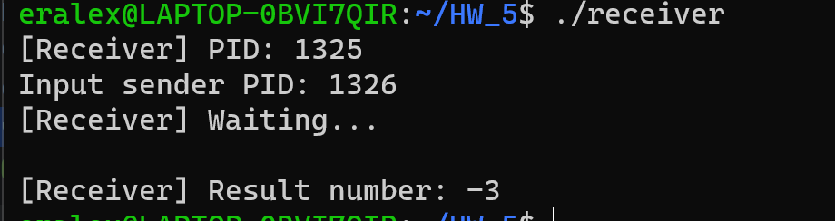
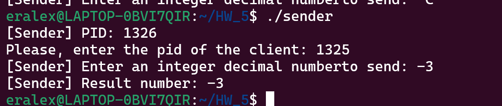

# Отчет

### Тест:
 _Положительное число_





_Отрицательное число_





### Код программ:

```c
#include <stdio.h>
#include <stdlib.h>
#include <signal.h>
#include <unistd.h>

int sender_pid;
int received_num = 0;
int current_bit = 0;

void process_SIGUSR1(int signal) {
    received_num |= (0 << current_bit);
    current_bit++;
    kill(sender_pid, SIGUSR1);
}


void process_SIGUSR2(int signal) {
    received_num |= (1 << current_bit);
    current_bit++;
    kill(sender_pid, SIGUSR1);
}

int main() {
    printf("[Receiver] PID: %d\n", getpid());
    printf("Input sender PID: ");
    scanf("%d", &sender_pid);

    signal(SIGUSR1, process_SIGUSR1);
    signal(SIGUSR2, process_SIGUSR2);

    printf("[Receiver] Waiting...\n");

    while (current_bit < 32) {
        pause();
    }

    printf("\n");

    printf("[Receiver] Result number: %d\n", received_num);  // Выводим полученное число

    return 0;
}
```

```#include <stdio.h>
#include <stdlib.h>
#include <signal.h>
#include <unistd.h>

int receiver_pid;
int current_bit = 0;
int num_to_send;

void handler(int sig) {
    if (sig == SIGUSR1) {
        current_bit++;
        if (current_bit < 32) {
            if ((num_to_send >> current_bit) & 1){
                kill(receiver_pid, SIGUSR2);
            }
            else{
                kill(receiver_pid, SIGUSR1);
            }
        } else {
            printf("[Sender] Result number: %d\n", num_to_send);
            exit(0);
        }
    }
}

int main() {
    printf("[Sender] PID: %d\n", getpid());
    printf("Please, enter the pid of the client: ");
    scanf("%d", &receiver_pid);
    printf("[Sender] Enter an integer decimal number to send: ");
    scanf("%d", &num_to_send);
    signal(SIGUSR1, handler);

    if (num_to_send & 1)
        kill(receiver_pid, SIGUSR2);
    else
        kill(receiver_pid, SIGUSR1);

    while (1) {
        pause();
    }

    return 0;
}
```