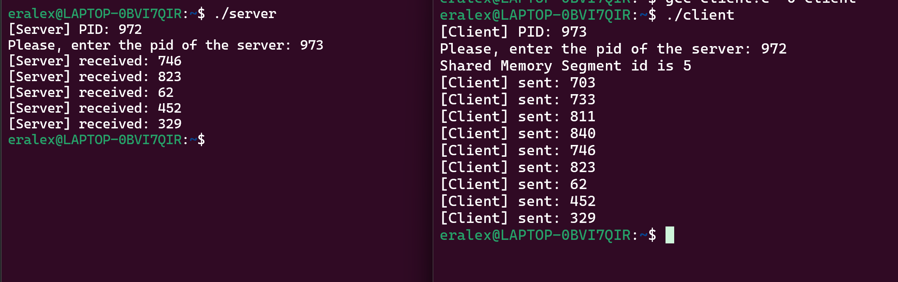
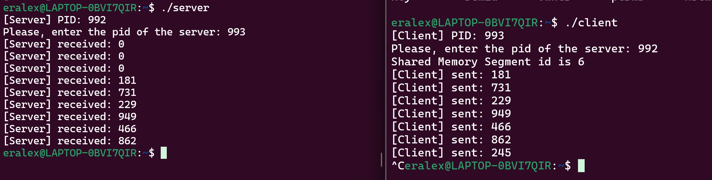

# Отчет

## V1

Метод завершения работы основывается на взаимной передаче сигнала о
необходимости завершения между процессами. Для этого,
PID каждого из процессов сохраняется заранее.Так как реализация прерываний через передачу pid, во время исполнения
программ часть первых
значений отправленных клиентом, в силу ожидания сервером pid клиента.





server:

```c
#include<stdio.h>
#include<unistd.h>
#include<sys/shm.h>
#include<stdlib.h>
#include<error.h>
#include<signal.h>

int shm_id;
int *share;
int client_pid;


void cleanup(int signum) {
    if (signum == SIGINT ) {
        kill(client_pid, SIGINT);
    }

    shmdt(share);
    shmctl(shm_id, IPC_RMID, NULL);
    exit(0);
}

int main() {
    printf("[Server] PID: %d\n", getpid());
    printf("Please, enter the pid of the server: ");
    scanf("%d", &client_pid);
    signal(SIGINT, cleanup);

    shm_id = shmget (0x2FF, getpagesize(), 0666 | IPC_CREAT);
    if(shm_id == -1){
        perror("Error 1");
        exit(1);
    }

    share = (int *)shmat(shm_id, 0, 0);
    if(share == NULL){
        perror("Error 2");
        exit(2);
    }

    while(1){
        sleep(1);
        printf("[Server] received: %d\n", *share);
    }

    return 0;
}
```

client:

```c
#include <stdio.h>
#include <unistd.h>
#include <sys/shm.h>
#include <stdlib.h>
#include <time.h>
#include <error.h>
#include <signal.h>

int shm_id;
int *share;
int server_pid;

void cleanup(int signum) {
    if (signum == SIGINT) {
        kill(server_pid, SIGINT);
    }
    shmdt(share);
    shmctl(shm_id, IPC_RMID, NULL);
    exit(0);
}

int main() {
    printf("[Client] PID: %d\n", getpid());
    printf("Please, enter the pid of the server: ");
    scanf("%d", &server_pid);
    int num = 0;
    signal(SIGINT, cleanup);
    srand(time(NULL));
    shm_id = shmget(0x2FF, getpagesize(), 0666 | IPC_CREAT);
    printf("Shared Memory Segment id is %d\n", shm_id);
    if (shm_id < 0) {
        perror("Error 1");
        exit(1);
    }
    share = (int *) shmat(shm_id, 0, 0);
    if (share == NULL) {
        perror("Error 2");
        exit(2);
    }
    while (1) {
        num = random() % 1000;
        *share = num;
        printf("[Client] sent: %d\n", num);
        sleep(1);
    }
    return 0;
}
```