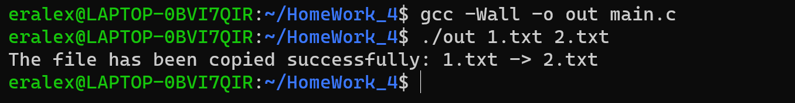
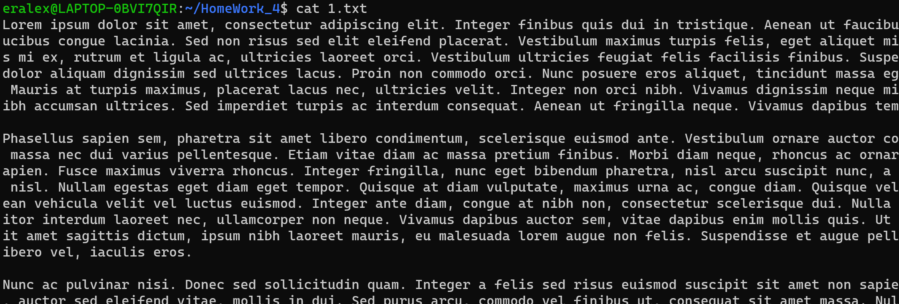
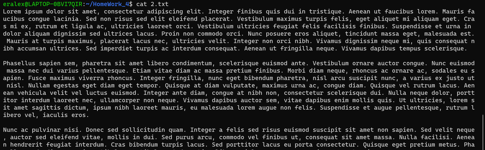
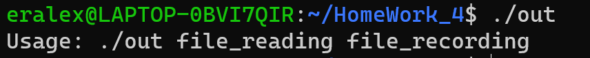
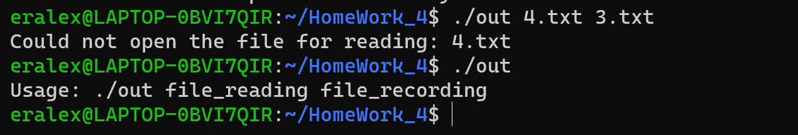

# Отчет

Ожидаемая оценка: 9

### Тесты

1. Корректный тест
   





2. Без аргументов:
   

3. Несуществующий файл:



### Текст программы c пояснениями:

```c
#include <stdio.h>
#include <stdlib.h>

#define BUFFER_SIZE 1024

int main(int argc, char *argv[]) {
    // Проверка количества переданных аргументов
    if (argc < 3) {
        printf("Usage: %s file_reading file_recording\n", argv[0]);
        return 1;
    }
    FILE *file_1 = fopen(argv[1], "r"); // Вызов на открытие файла
    if (file_1 == NULL) {
        printf("Could not open the file for reading: %s\n", argv[1]);
        return 1;
    }
    FILE *file_2 = fopen(argv[2], "w"); // Вызов на открытие файла
    if (file_2 == NULL) {
        printf("Could not open the file for writing: %s\n", argv[2]);
        fclose(file_1);
        return 1;
    }
    char buffer[BUFFER_SIZE];// Буффер на чтение файла
    size_t bytes;
    // Чтение файла 1 циклически
    while ((bytes = fread(buffer, 1, sizeof(buffer), file_1)) > 0) {
        fwrite(buffer, 1, bytes, file_2); // Вызов на запись в файл 2
    }
    // Вызов закрытия файлов
    fclose(file_1);
    fclose(file_2);
    printf("The file has been copied successfully: %s -> %s \n", argv[1], argv[2]);
    return 0;
}
```
